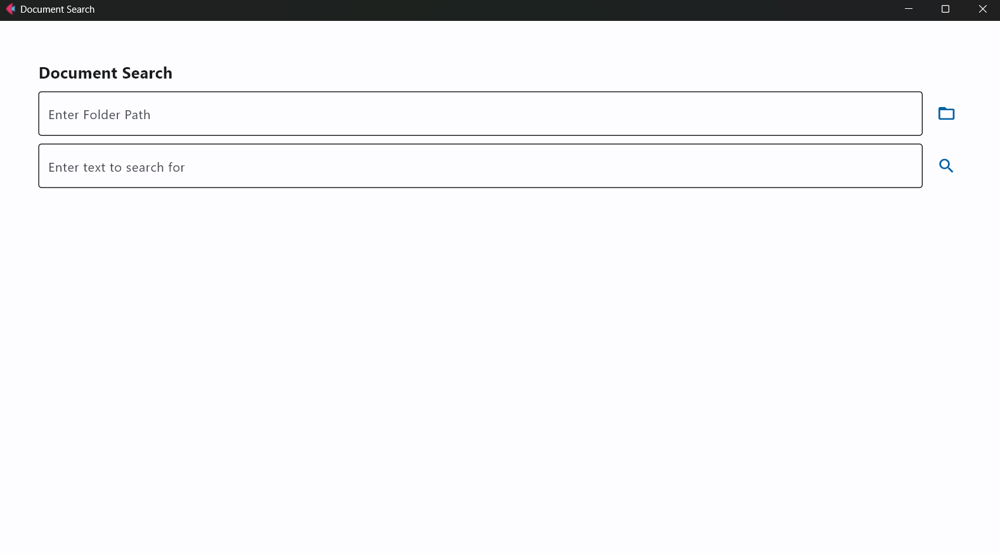

# Document Search Application

This Document Search Application is a powerful tool that allows users to search through a collection of documents using semantic similarity. It utilizes advanced natural language processing techniques to find relevant documents based on the content rather than just keywords.

## Features
- Import documents from a specified folder
- Create and manage a vector database of document embeddings
- Perform semantic searches on the document collection
- Display search results with relevance scores

## Requirements
- Python 3.9.16
- Flet: For creating the graphical user interface
- SentenceTransformers: For generating document embeddings
- ChromaDB: For efficient storage and retrieval of vector embeddings

## Installation

1. Clone the repository:
```bash
git clone https://github.com/PongpreechaSuea/Text-Search-Document.git
cd Text-Search-Document
```

2. Create a virtual environment (optional but recommended):
```bash
python -m venv venv
source venv/bin/activate  # On Windows use venv\Scripts\activate
```

3. Install the required packages:
```bash
pip install -r requirements.txt
```

## Usage

1. Run the main application:
```bash
python run.py
```

2. Use the GUI to:
- Enter a folder path containing your documents
- Click the folder icon to add documents to the search index
- Enter search terms in the search box
- Click the search icon to find relevant documents

## Project Structure
- `main.py`: The main application file containing the GUI logic
- `models/document_finder.py`: Contains the DocumentFinder class for locating documents
- `models/document_gatherer.py`: Contains the DocumentModel class for managing document embeddings and searches


## Example


<p align="center">
  
</p>
